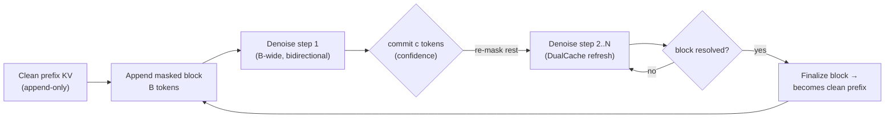
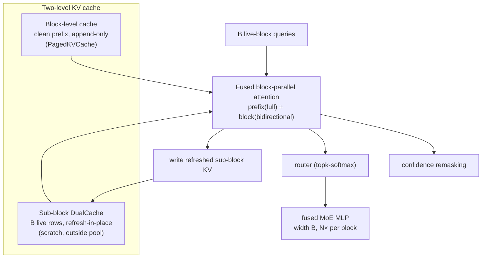
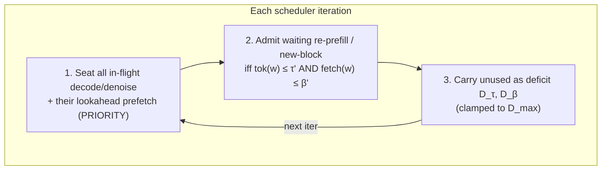

# PD-dflash-MoE: Serving Block-Diffusion LLMs on an Expert-Offloading MoE System

> **Status:** Draft — design/architecture proposal. **No implementation**; this
> document motivates and sketches a design, and states the one experiment that
> gates it.
> **Anchor example:** dense Qwen block-diffusion ("dflash", e.g. Fast-dLLM v2 /
> BD3LM) is used to teach the mechanics; the real target is the **MoE × diffusion**
> intersection (e.g. LLaDA-MoE) where MoE-Infinity's expert offloading applies.

## TL;DR / Thesis

Autoregressive (AR) serving stacks — including MoE-Infinity — assume **(i)**
single-query causal decode attention and **(ii)** prefill-once + an append-only KV
cache reused token-by-token. Block-diffusion LLMs ("dflash") break **both**: they
generate a *block* of tokens by running **N parallel denoising steps** over a
*bidirectionally-attended* block, with **KV that must be refreshed in place** each
step. Every block boundary becomes a **recurring re-prefill**, which makes
prefill/decode (PD) scheduling qualitatively harder ("PD-dflash scheduling").

**The MoE-specific insight (the differentiator).** For an *expert-offloading*
system, block-diffusion is not merely harder — it exposes a **structural prefetch
lookahead** that AR decoding lacks. Because the *same* block is re-denoised N times
over *fixed* positions, step 1's routing largely reveals the expert working set
that steps 2..N re-touch. Diffusion therefore hands the prefetcher an **N-step
lookahead window over a stable working set**, converting diffusion's "wider,
burstier" expert working set from a **cost** into an **amortization advantage**:
one wide expert fetch is hidden under the block's N-step compute window. This is
exactly the memory-constrained regime MoE-Infinity exists to serve.

> **The whole thesis reduces to one measurable number** — the per-step expert
> *churn* `q` (§6, §8). Run that measurement first; if it fails, pivot to the
> speculative-decoding framing (§9).

## 1. Background: block-diffusion "dflash"

**Concrete Qwen instances that exist today.**
- **Fast-dLLM v2** (adapts Qwen2.5-1.5B / 7B-Instruct into block-diffusion decoders
  with ~1B tokens of fine-tuning). Hierarchical cache: a **block-level cache**
  (clean prefix) + a **sub-block DualCache** (refreshed per step). ~2.5× over AR
  decode.
- **BD3LM** (`Qwen3-0.6B-diffusion-bd3lm`, `Qwen2.5-Coder-diffusion-bd3lm`):
  `block_size=32`, an explicit number of denoising `steps`, `low_confidence`
  remasking.
- **MoE × diffusion intersection:** **LLaDA-MoE** (diffusion + MoE) is the concrete
  target class; a Qwen-MoE-diffusion would be the ideal fit for MoE-Infinity.

**Decode mechanics (per block).**
1. Append a masked block of `B` tokens after the clean prefix.
2. Run `N` denoising steps. Each step is one forward pass over the block with
   **bidirectional** attention inside the block + causal attention to the clean
   prefix; all masked positions are predicted in parallel.
3. **Remasking:** commit a subset of positions (e.g. highest-confidence), re-mask
   the rest, iterate.
4. When the block resolves, it becomes clean prefix; move to the next block.

**Why AR KV caching breaks.** Committing a token *shifts* the KV activations of the
other in-block tokens (bidirectional attention), so exact AR caching is impossible.
Systems use **approximate caching** (Fast-dLLM DualCache, dKV-Cache) that refreshes
KV and reuses it across intervening steps. At the serving layer this means dLLM
**decodes are block-sized**, **prefills recur** (cache-refresh re-prefills at block
boundaries), and **bidirectional attention precludes chunked prefill** — so the AR
stall-free colocated-batching trick does not apply.



## 2. MoE-Infinity baseline and the mismatch

MoE-Infinity = **expert offloading** (weights on CPU/SSD, fetched just-in-time; an
activation-aware cache; a tracer → predictor → prefetcher that hides transfer cost),
plus a production continuous-batching server. Each relevant layer and its exact
mismatch with dflash:

| Layer | Today (AR) | dflash needs | Code |
|---|---|---|---|
| Sequence state | WAITING / PREFILL / DECODE | + **DENOISE** (block re-prefill) | `serving/sequence.py` (`SequenceStatus`) |
| Scheduler | separate `prefill`/`decode` batches; clean split | recurring re-prefill; block-sized decodes; no chunking | `serving/scheduler.py` |
| Batch PD split | `split_prefill_decode_batch()` (mixed already supported) | reuse; "prefill" now = a width-`B` denoise step | `serving/batch.py` |
| Attention | `_prefill_forward` / `_decode_forward`; decode = single-query causal | **block-parallel** mask (block-diagonal + causal-prefix) | `runtime/attention_backend.py` |
| KV cache | **append-only** paged (slot_mapping) | **refresh-in-place** DualCache over the live block | `serving/kv_cache.py` |
| Router / MoE MLP | fused topk-softmax + fused MoE MLP; decode-width | width `B` every step, **N× per block** | `core/parallel/expert_dispatcher.cpp` |
| Expert memory | tracer on **AR token trajectories**; predictor; prefetcher | tracer on **block-diffusion trajectories**; lookahead | `memory/{expert_tracer,expert_predictor,expert_prefetcher}.py` |
| Budget | expert-vs-KV split (static-ish) | rebalance **per denoising step** | `memory/memory_coordinator.py` |
| **Existing seed** | `DFlashSpeculator` (block-parallel drafter) | the hook this generalizes | `spec_decode/dflash.py` |

**Takeaway:** MoE-Infinity already has the primitives (PD split, paged KV, expert
prefetch, a `dflash` seed). This is a **re-composition**, not a rewrite.

## 3. Three coupled axes

1. **Kernels (§4)** — a block-parallel attention kernel + a two-level cache.
2. **PD-dflash scheduling (§5)** — recurring re-prefills under a deficit budget.
3. **Expert-prefetch lookahead (§6)** — the differentiator, unique to offloading MoE.

They are coupled: the lookahead (§6) changes the scheduler's admission unit (§5),
and the kernel's fixed-N mode (§4) makes the lookahead more predictable.

## 4. Kernel design

**Mask.** Each of the `B` live-block queries attends to `[clean-prefix(P) :
block(B)]`: full attention to the finalized prefix + an **all-ones (bidirectional)**
`B×B` block. This is a **block-diagonal(bidirectional) + dense-prefix** mask —
distinct from AR prefill (growing lower-triangular) and AR decode (single query row).

**Two-level cache.**
- **Block-level cache = clean-prefix KV** — append-only; lives in the existing
  `PagedKVCache`; grows by `B` only when a block *finalizes*. No new machinery.
- **Sub-block DualCache = KV of the `B` live positions** — **mutable**, refreshed
  each step, size `O(B × layers)`; kept **outside** the paged pool as a fixed-size
  scratch buffer, cleanly sidestepping the append-only mismatch.

**Fusion.** Fuse into one kernel: prefix-attention read (block-level cache) +
intra-block bidirectional attention (sub-block scratch) + write refreshed sub-block
KV — because the sub-block K/V is read *and* written per step and reused across
steps. Keep **routing** (topk-softmax) and **remasking** (top-k/threshold) as
separate, reused kernels.

**CUDA-graph capture (the sharp edge).** Decode-graph capture is shape-static;
dflash breaks it via variable `N` and variable committed-count. Two modes, a knob:
- **fixed-N (capturable):** commit exactly `c = ⌈B/N⌉` tokens/step → static shapes →
  one captured graph per prefix-length bucket, replayed `N×`. Slight quality cost.
- **confidence-adaptive (eager):** variable commit → no capture → best quality.

Fixed-N is doubly attractive for offloading: capturable **and** it makes the
step-to-step expert set more predictable (better lookahead, §6).



## 5. PD-dflash scheduling

**Why the clean split breaks.** Every block boundary is a **re-prefill**, so requests
cross the PD boundary repeatedly and the prefill/decode work ratio depends on each
request's *progress*. **Bidirectional attention precludes chunked prefill**, so you
cannot split a denoise step to keep co-batched decodes stall-free. Static PD
disaggregation therefore **strands capacity**.

**Design.** Add a **DENOISE** sequence state; schedule a denoise step like a width-`B`
mini-prefill that also carries decode-like SLOs. Adopt a **deficit token-budget**
scheduler: seat in-flight decode/denoise first (never displaced), admit a whole
indivisible re-prefill/denoise-step only when budget + carried deficit fits →
**amortized** stall-free batching *without* chunking (the only substitute once
chunked prefill is unavailable).

**Two-budget deficit (composition with §6).** Model expert bandwidth as a *second*
deficit dimension → a **2-D deficit-round-robin over {tokens, expert-bytes}**. Admit
a **new block** only if both a token test and a **fetch-hiding test** pass
(§7). Steps 2..N are nearly free once step 1 pre-warms the block (§6), so **the real
gate is block admission, not per-step** — the lookahead moves the decision from
per-token (AR) to per-block (dflash). In-flight denoise + its lookahead prefetch are
**seated with priority** (symmetric to "decodes never displaced"), guaranteeing
liveness. The only feasibility constraint is `D_max ≥ max-single-item cost` per
dimension.



## 6. Expert-prefetch lookahead (the differentiator)

**Mechanism.** At step `t`, a position's router input drifts as its neighbors commit.
Early (mostly-masked) positions are **prefix-dominated** → routing is homogeneous and
stable, and the routed *union* is **widest**. Late (mostly-committed) positions
individuate → routing churns, but the union is **narrow** (few masked positions
remain).

**Falsifiable prediction (drift model).** With fixed-N, committed fraction
`ρ(t)=t/N`, and saturation `s=B·k/Eℓ` (§7), the routed-union width is flat then
linearly decreasing with a **knee at `ρ*=1−1/s`**; and `J(1,t)=W(t)/W(1)` (Jaccard
vs step 1) stays 1 until the knee, then `= (1−ρ(t))·s`. Introduce **`q`** = fraction
of a masked position's experts that swap out of `U(1)` per step; then **prefetch
coverage ≈ 1 − q** and residual traffic `= q·Σ_t W(t)·w_e`. **The whole thesis
reduces to measuring `q`** (§8).

**Why AR can't do this.** AR decode touches a small per-token expert set with ≈one
token of lookahead and is memory-bound → transfer is exposed. dflash's `N·t_step`
window is the extra slack, and the block's fixed positions make the working set
predictable.

**Graceful degradation (never regress below baseline).** Two tiers:
- *Tier 1 — lookahead prefetch:* at step 1, speculatively fetch the predicted
  step-2..N union (superset heuristic, refined by a stability prior).
- *Tier 2 — correct-on-miss:* reuse the existing `correct_prefetch()` for drifted
  positions.
- *Online modulation:* track realized coverage (`≈1−q`); shrink the speculative
  fetch when `q` is high (avoid bandwidth waste/thrash), widen it (and prefetch the
  next block) when low. Worst case degrades to AR correct-on-miss — **no regression
  below today's MoE-Infinity behavior**.

## 7. Analytical cost model

Let `M = L·Eℓ·w_e` be total routed-expert bytes, `s = min(1, B·k/Eℓ)` saturation,
`r` resident fraction, `BW` expert bandwidth, `t_step` one width-`B` forward.

**Saturation fact (it helps).** For realistic settings a block *saturates*:
Qwen3-30B-A3B-style `Eℓ=128, k=8, B=32` → `B·k=256 ≥ 128` ⇒ `s=1`; a single block
activates ~the entire expert set of every layer. So (a) naive per-step fetching is
prohibitive, and (b) the step-1 union ≈ the whole set → the superset hypothesis
becomes near-trivially true. Saturation **strengthens** the lookahead.

**Amortization / hiding inequality (the analytical heart).** The wide step-1 fetch is
fully hidden iff

```
(1 − r) · s · M / BW  ≤  N · t_step
```

Speedup over naive (transfer-bound) ≈ `(1−r)·s·M / (BW·t_step)` — larger when `M`
big, `BW` small, cache cold (MoE-Infinity's niche).

**dflash vs AR, bytes per committed token.** Ratio `dflash/AR = 1 / (s · missrate_AR)`
— dflash fetches **fewer** bytes/token exactly when the block **saturates** *and* AR
is in a **high-miss (memory-constrained)** regime. When AR hits cache well, AR wins —
the claim is **regime-scoped and honest**, not universal.

**Worked example (illustrative, order-of-magnitude).** `L=48, Eℓ=128, k=8, w_e≈2.4 MB
(FP4)` ⇒ `M≈14 GB`; `B=32,N=8,s=1,r=0.5` ⇒ block fetch `≈7 GB`; `BW≈20 GB/s` ⇒
`0.35 s`; `t_step≈60 ms` ⇒ `N·t_step≈0.48 s > 0.35 s` ⇒ **fetch hidden** ⇒ ≈15
ms/token vs ≈2.8 s naive (~6× better); ~2× fewer bytes/token than AR at `missrate≈0.5`.
*(Numbers illustrative — §8 measures the real ones.)*

## 8. Evaluation plan

**Claim → experiment.**
- C1 (lookahead exists) → prefetch coverage, lookahead ON vs OFF.
- C2 (strongest where fetch is widest) → per-step-index plot of union-width,
  `J(1,t)`, coverage; expect the §6 knee.
- C3 (offloading-diffusion beats naive) → goodput vs request rate.
- C4 (co-design beats either half) → 2×2 {deficit sched} × {lookahead}.

**Baselines** (each isolates one thing): **B0** AR MoE on MoE-Infinity; **B1** dflash
+ unchanged AR prefetcher (*isolates offloading contribution*); **B2** dflash +
deficit scheduler, no expert coupling (*isolates co-design*); **B3** non-offloading
diffusion (resident experts, *upper bound*).

**Metrics:** TTFT; TBT / per-block latency; goodput@SLO; expert cache hit rate;
prefetch coverage; effective committed tokens/step; expert-vs-KV occupancy; **wasted
prefetch bytes** (speculation cost).

**Ablations:** lookahead on/off; fixed-N vs adaptive (report quality delta); per-step
`memory_coordinator` rebalance; strong vs approximate DualCache; `B` and `N` sweeps
(shapes predicted by §7).

**Run first — the stability study (gates everything):** for a real diffusion-MoE
(LLaDA-MoE), measure `J(1,t)` and union-width vs `t`, per layer, across
temperature/`cfg_scale` — i.e. measure `q`. **If it fails, pivot** to the speculative
framing (§9).

**Money plot:** goodput vs request rate with four curves (B3 upper bound, full
system, B2 scheduler-only, B1 prefetch-off) — showing the co-design approaches the
resident-expert upper bound *without* holding experts resident.

**Threats to validity:** single-model locality (test ≥2 checkpoints); fixed-N quality
regression (always report quality); synthetic traces (use ShareGPT + arXiv); "free
lunch" (report wasted prefetch bytes).

## 9. Related work

- **Sangam** — serving diffusion LLMs on the AR stack: block-sized decodes, recurring
  prefills, deficit token-budget scheduling, hybrid overflow. *Delta:* we add the
  **expert-offloading** dimension (a 2-D deficit over tokens **and** expert-bytes).
- **Fast-dLLM v1 / v2**, **BD3LM / dLLM** — block-diffusion adaptation of AR LLMs +
  DualCache. *Delta:* we treat their caches/kernels as the substrate and design the
  **serving + offloading** layer.
- **dKV-Cache** — approximate KV caching for bidirectional attention. *Delta:* used as
  the sub-block cache primitive.
- **DistServe / Splitwise / Mooncake / TetriInfer** — AR PD-disaggregation.
  **Nexus** — intra-GPU PD disaggregation. **Kairos** — prefill deflection.
  **Adrenaline** — attention disaggregation. *Delta:* these assume AR PD structure;
  dflash's recurring re-prefill + no-chunking changes the scheduling regime.
- **LLaDA-MoE** — the concrete diffusion-MoE target. *Delta:* the model; we are the
  serving/offloading system.
- **MoE-Infinity** — this repo (expert offloading, tracer/predictor/prefetcher). *Delta:*
  we extend its prefetch + scheduler for block-diffusion.

## 10. Symbol table

| Symbol | Meaning |
|---|---|
| `L` | number of layers |
| `Eℓ` | routed experts per layer |
| `k` | top-k routed experts per token |
| `w_e` | bytes for one expert's weights (one layer), offloaded dtype (FP4/FP8) |
| `M = L·Eℓ·w_e` | total routed-expert bytes |
| `B` | block size (tokens) |
| `N` | denoising steps per block |
| `c = B/N` | committed tokens per step (fixed-N) |
| `BW` | effective host→GPU expert fetch bandwidth |
| `t_step` | compute time of one width-`B` forward (attn + MoE MLP) |
| `r` | resident fraction of experts already cached |
| `s = min(1, B·k/Eℓ)` | per-step expert-set saturation |
| `ρ(t) = t/N` | committed fraction at step `t` |
| `ρ* = 1 − 1/s` | drift-model knee (union-width inflection) |
| `W(t)` | routed-union width at step `t` |
| `J(1,t)` | Jaccard overlap of routed union at step `t` vs step 1 |
| `q` | per-step expert churn out of the step-1 union (coverage ≈ 1−q) |
| `τ`, `β` | per-iteration token / expert-byte budgets |
| `D_τ`, `D_β`, `D_max` | carried deficits and the deficit cap |

## 11. Open questions

- **Gating experiment:** measure `q` / the `ρ*` knee on LLaDA-MoE before investing
  further. If the working set churns (`q` large), the lookahead advantage collapses →
  pivot to §9's speculative framing (the `DFlashSpeculator` seed).
- **Framing:** native diffusion serving vs speculative-decode framing as the primary
  contribution.
- **Kernel default:** fixed-N (capturable, prefetch-friendly) vs confidence-adaptive
  (higher quality) as the shipped default; expose as a knob either way.
- **Target model/hardware** for a first prototype.
