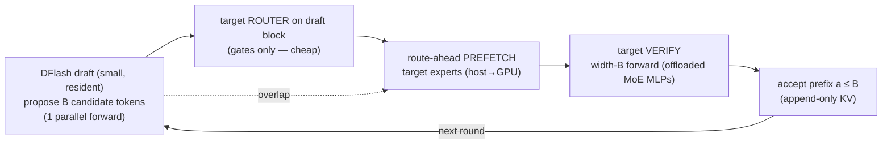
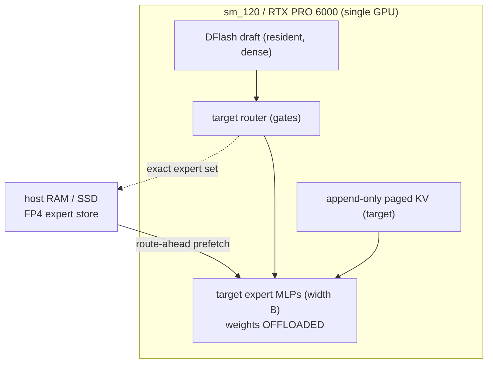
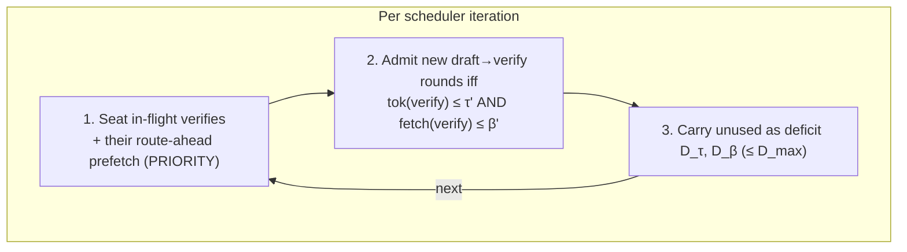

# PD-DFlash-MoE: Expert-Offload-Aware DFlash Speculative Decoding for MoE Targets

> **Status:** Draft — design/architecture proposal. **No implementation**; this
> document motivates and sketches a design and states the experiment that gates it.
> **What "DFlash" is here:** the **DFlash** method of *Chen, Liang, Liu — "DFlash:
> Block Diffusion for Flash Speculative Decoding"* (Z Lab, [z-lab.ai](https://z-lab.ai/projects/dflash/),
> arXiv:2602.06036). DFlash is a **speculative-decoding** method: a lightweight
> (~0.8 B) **block-diffusion draft model** proposes a whole block of tokens in a
> single parallel forward pass; the large **target model verifies** them in
> parallel (lossless — the target's output distribution is preserved).
> **Target hardware:** a single **sm_120 / RTX PRO 6000 (Blackwell)** GPU, available
> locally; MoE target experts are **offloaded** (host RAM / SSD) with the native
> FP4 path (`moe_infinity._v4_fp4`).

## TL;DR / Thesis

Speculative decoding hides an autoregressive (AR) target's latency by having a cheap
**drafter** propose tokens that the target **verifies** in parallel. For a
**Mixture-of-Experts target whose experts are offloaded**, the bottleneck is not
draft quality — it is **fetching the target's experts** for each verification step.
MoE-Infinity's whole value is hiding that fetch.

**The insight (why DFlash × expert-offloading is synergistic).** A DFlash draft
proposes the **entire block of candidate tokens before the target verifies them**.
Those candidate token IDs *determine* which target experts the verification will
touch — via the target's (cheap) router. So we can **run the target router on the
draft block, get the exact expert set, and prefetch those experts during the draft
forward**, so they are resident when the expensive width-`B` verification MLPs run.
This is a **route-ahead prefetch**: not a *speculative* guess (as in AR decode or
native diffusion), but a **near-exact** prediction of the verification's expert
working set, computed one step ahead of the fetch that dominates offloaded-MoE cost.

> DFlash turns MoE-Infinity's hardest problem — hiding target expert transfer — into
> a *scheduled, near-exact prefetch*, because the drafted block reveals the target's
> expert working set before the target needs it.

**Existing seed:** MoE-Infinity already ships `spec_decode/dflash.py`
(`DFlashSpeculator`, `spec_generate()`). This design **extends that seed** with
expert-offload-aware route-ahead prefetch + scheduling; it is a re-composition, not
a rewrite.

## 1. Background: DFlash speculative decoding

**Mechanics (per speculation round).**
1. **Draft.** A small block-diffusion model proposes `B` candidate tokens in a
   single parallel forward (block sizes 8–16; often **a single denoising step**).
   The draft is conditioned on the target's hidden features via **KV injection**
   into every draft layer, and reuses the target's embedding + LM head — only a few
   intermediate layers are trained (~0.8 B params).
2. **Verify.** The **target** runs **one width-`B` forward** over the `B` candidates
   and accepts the longest correct prefix (acceptance length `a ≤ B`; reported
   `a ≈ 6–8` at `B=16`).
3. **Advance.** Accepted tokens extend the sequence (append-only KV, as in AR); the
   next round drafts from the last accepted token.

DFlash reports up to **~6× lossless** speedup on Qwen3-8B (~2.5× over EAGLE-3), and
**3.0–3.5×** on the MoE **Qwen3-Coder-30B-A3B**. Because drafting is a single
parallel forward, its cost is ~flat in block size — so `B` can be large.

**Ready-made draft/target pairs (`z-lab`, HuggingFace).** No training required to
prototype. Pairs that **MoE-Infinity already supports as targets**:

| Target (MoE-Infinity supported) | DFlash draft (`z-lab/…`) |
|---|---|
| `openai/gpt-oss-20b` | `z-lab/gpt-oss-20b-DFlash` |
| `openai/gpt-oss-120b` | `z-lab/gpt-oss-120b-DFlash` |
| `Qwen/Qwen3-Coder-30B-A3B` (MoE) | `z-lab/Qwen3-Coder-30B-A3B-DFlash` |
| `Qwen/Qwen3.5-35B-A3B` (MoE) | `z-lab/Qwen3.5-35B-A3B-DFlash` |
| `Qwen/Qwen3.5-122B-A10B` (MoE) | `z-lab/Qwen3.5-122B-A10B-DFlash` |
| DeepSeek-V4-Flash | *"coming soon"* (z-lab) |

> **Relatives (not DFlash):** *native* block-diffusion LLMs — Fast-dLLM v2, BD3LM,
> and the diffusion-MoE **LLaDA-MoE** — generate by iterative denoising *as the
> decode itself*. They are a harder, separate serving regime (see §9); DFlash
> instead confines diffusion to a **drafter** and keeps AR-style verification.



## 2. MoE-Infinity baseline and where DFlash plugs in

MoE-Infinity = **expert offloading** (target expert weights on CPU/SSD, fetched
just-in-time; activation-aware cache; tracer → predictor → prefetcher) + a
continuous-batching server. DFlash integration surface:

| Concern | Today (AR) | DFlash needs | Code |
|---|---|---|---|
| Loop | token-by-token decode | **draft → verify** rounds (accept `a≤B`) | `spec_decode/dflash.py` (`DFlashSpeculator`) |
| Verify step | single-query causal decode | **width-`B`** target forward (mini-prefill) | `runtime/attention_backend.py`, `serving/batch.py` (`split_prefill_decode_batch`) |
| KV | append-only paged | append-only for target (unchanged); draft uses **KV injection** | `serving/kv_cache.py` |
| Router / MoE MLP | decode-width | **width-`B`** verification; router run **ahead** on draft block | `core/parallel/expert_dispatcher.cpp`, fused topk-softmax |
| Expert prefetch | AR token-trajectory speculation | **route-ahead** (exact set from draft block) | `memory/{expert_tracer,expert_predictor,expert_prefetcher}.py` |
| Budget | expert-vs-KV split | rebalance around bursty width-`B` verify | `memory/memory_coordinator.py` |
| Scheduling | PREFILL/DECODE queues | **DRAFT/VERIFY** rounds, variable acceptance | `serving/scheduler.py` |

**Draft placement.** The DFlash draft is small and dense → keep it **resident** on
the sm_120 GPU (it reuses the target embedding + LM head). Only the **target MoE
experts** are offloaded — exactly MoE-Infinity's job.

## 3. Three coupled axes

1. **Verification kernels (§4)** — the target forward is width-`B`, not width-1.
2. **Draft/verify PD scheduling (§5)** — variable acceptance, bursty verify steps.
3. **Route-ahead expert prefetch (§6)** — the differentiator, unique to offloaded MoE.

They couple: the draft (axis 2) produces the block that lets the router predict and
prefetch the verify experts (axis 3), which must be resident before the width-`B`
verification kernel (axis 1) runs.

## 4. Verification & draft kernels

**Target verification = a width-`B` mini-prefill.** Verifying `B` candidates is one
causal forward over `B` new positions against the append-only KV prefix — this
already maps onto MoE-Infinity's prefill path (`split_prefill_decode_batch`), *not*
the single-query decode kernel. The MoE MLPs run at **width `B`** (the expert-heavy,
offload-bound part).

**Draft forward.** Block-diffusion, single (or few) parallel denoising step(s) over
`B` masked positions with **KV-injected** target features. Small and dense → cheap,
resident; no offload. (If a draft variant uses multi-step denoising, the intra-block
bidirectional mask + a small mutable sub-block cache from the *native*-diffusion
design apply — but single-step DFlash avoids this entirely.)

**CUDA-graph capture (sm_120).** Verification width `B` is fixed per config →
**capturable**; capture one graph per prefix-length bucket, as the AR decode path
already does. Acceptance length `a` varies but only changes how many tokens are
*appended* after verification, not the verify forward's shape. On Blackwell the
native FP4 expert path (`moe_infinity._v4_fp4`) is auto-selected (1.5–3.2× faster
than the fallback).



## 5. PD-DFlash scheduling (draft/verify rounds)

**Why it differs from AR PD.** A round is **draft (cheap, resident) + verify
(width-`B`, expert-heavy, offload-bound)**. The verify step is a bursty mini-prefill;
acceptance `a` is variable, so KV growth and per-round work vary. Batching many
requests means interleaving many verify steps, each demanding a wide target expert
fetch.

**Design.** Add **DRAFT** / **VERIFY** round states. Schedule verify steps under a
**deficit token-budget** (seat in-flight verifies first; admit new rounds when
budget + carried deficit fits) — amortized stall-free without needing to chunk the
indivisible width-`B` verify. Extend to a **2-D deficit over {tokens, expert-bytes}**:
admit a round's verify only when its **route-ahead fetch can be hidden** under the
draft/router window (§7). In-flight verifies **and their route-ahead prefetch are
seated with priority** (never displaced), guaranteeing liveness; the only feasibility
constraint is `D_max ≥ max-single-item cost` per dimension.



## 6. Route-ahead expert prefetch (the differentiator)

**Mechanism.** The draft yields the `B` candidate token IDs **before** verification.
Run the target **router** (gates only — cheap vs. the expert MLPs) on those tokens to
obtain the **exact** set of experts the width-`B` verify will read; issue the fetch
(host→GPU) **during** the draft forward + router compute, so experts are resident
when the verify MLPs run.

**Why this beats AR / native-diffusion lookahead.** AR decode has ≈one token of
lookahead and must *speculate* the next expert set; native diffusion re-denoises and
suffers routing *drift*. DFlash gives the **actual candidate tokens** → a
**deterministic** router decision → the **exact** expert set, one step ahead. The
only imperfection is **rejection**: positions beyond acceptance `a` were prefetched
but unused. Because a width-`B` block *saturates* the expert set (§7) and experts are
shared across positions, rejected-position waste is small — the prefetched set is
essentially "the block's experts," which the accepted prefix needs anyway.

**Graceful degradation (never regress below baseline).**
- *Tier 1 — route-ahead prefetch* of the exact router set for the draft block.
- *Tier 2 — correct-on-miss* (`correct_prefetch()`) for any expert not yet resident.
- *Modulation:* if drafts are frequently rejected early (low `a`), shrink the
  route-ahead horizon to the first few positions; worst case = AR correct-on-miss →
  **no regression** below today's MoE-Infinity behavior, upside when `a` is high.

**Overlap budget.** The hideable window is `t_draft + t_router`. Because the draft is
resident and cheap and the router is gates-only, this window is small — so the design
also **prefetches the *next* round's likely experts** during the current verify
(hot-expert reuse across rounds), widening the window.

## 7. Analytical cost model

Let `M = L·Eℓ·w_e` be total target routed-expert bytes, `s = min(1, B·k/Eℓ)`
saturation, `r` resident fraction, `BW` host→GPU expert bandwidth (PCIe5-class on
sm_120), `t_verify` the width-`B` target forward, `t_draft`+`t_router` the route-ahead
window.

**Saturation (it helps).** Verifying `B` candidates routes `B·k` experts/layer; for
`Eℓ=128, k=8, B=16` → `B·k=128 ≈ Eℓ` ⇒ `s≈1`: a verify step touches ~the whole
expert set. So the route-ahead fetch is essentially "prefetch the block's experts,"
and the accepted prefix reuses them → **rejection waste is small**.

**Route-ahead hiding inequality.** The verify fetch is hidden iff
```
(1 − r) · s · M / BW  ≤  t_draft + t_router + overlap_with_prev_verify
```
Unlike native diffusion (where the window is `N·t_step` but the set drifts), here the
set is **exact** and the window is the draft+router time (plus cross-round overlap).

**Per accepted token.** A round fetches ≈`(1−r)·s·M` bytes and yields `a` accepted
tokens ⇒ **`(1−r)·s·M / a`** bytes/accepted-token; larger `a` (DFlash reports 6–8)
directly amortizes the offload cost. Baseline AR-offload fetches per *single* decoded
token with ≈one-token lookahead → transfer exposed. **DFlash wins in the
memory-constrained regime** (offloaded experts, cold cache) and is honest elsewhere.

**Worked example (illustrative — sm_120 / RTX PRO 6000).** `L=48, Eℓ=128, k=8,
w_e≈2.4 MB (FP4)` ⇒ `M≈14 GB`; `B=16,s≈1,r=0.5` ⇒ round fetch `≈7 GB`; PCIe5-class
`BW≈50 GB/s` ⇒ `≈0.14 s`. With `a≈8`, that is `≈18 ms/accepted-token` of exposed
fetch *if unhidden*; route-ahead + cross-round overlap targets hiding most of it under
draft+verify compute. *(Numbers illustrative; §8 measures the real ones on the
device.)*

## 8. Evaluation plan

**Hardware.** Single **RTX PRO 6000 (sm_120, Blackwell)**, local; target MoE experts
FP4-offloaded to host RAM via `moe_infinity._v4_fp4`; DFlash draft resident.

**Claims → experiments.**
- C1 (route-ahead is near-exact) → **prefetch coverage** = fraction of verify experts
  resident, route-ahead ON vs OFF; expect ≫ AR speculation.
- C2 (offloading contribution) → **goodput** with DFlash + route-ahead vs DFlash +
  unchanged AR prefetcher.
- C3 (end-to-end) → **tokens/s and speedup vs AR-offload baseline** at concurrency
  1..32.

**Baselines.** **B0** AR MoE on MoE-Infinity (offloaded, no spec) — the reference;
**B1** DFlash + unchanged AR prefetcher (*isolates route-ahead*); **B2** DFlash +
deficit scheduler, no expert coupling (*isolates co-design*); **B3** target with
experts **resident** (no offload) — upper bound (may not fit 96 GB for 120 B → shows
the point of offloading).

**Metrics.** Output tokens/s; **acceptance length `a`**; TTFT; per-round latency;
goodput@SLO; **expert cache hit rate**; **route-ahead prefetch coverage**; **wasted
prefetch bytes** (rejected-position experts); expert-vs-KV occupancy.

**Ablations.** route-ahead ON/OFF; **block size `B`** (8 vs 16) and its effect on `a`
and saturation; per-round `memory_coordinator` rebalance; cross-round next-expert
prefetch ON/OFF; FP4 native path vs fallback.

**Generalization (must-cover targets).** Run the same design unchanged on **≥ Qwen
and GPT-OSS** MoE targets with `z-lab` DFlash drafts: **`Qwen3-Coder-30B-A3B`**,
**`Qwen3.5-35B-A3B`**, **`gpt-oss-20b`**, **`gpt-oss-120b`** (the 120 B especially
exercises offloading on a single 96 GB card). DeepSeek-V4-Flash when its DFlash draft
lands. Route-ahead prefetch is architecture-agnostic at the MoE level (router →
expert set → fetch), so the design should carry across these unchanged.

**Money plot.** tokens/s (or goodput) vs request rate: **B0 (AR-offload)** < **B1
(DFlash, AR prefetch)** < **our route-ahead co-design** → **B3 (resident upper
bound)** — showing the co-design approaches resident-expert throughput *without*
holding the target's experts resident.

## 9. Related work

- **DFlash** (Z Lab; Chen, Liang, Liu; arXiv:2602.06036) — block-diffusion drafter +
  KV-injected target features; SGLang (`--speculative-algorithm DFLASH`) & vLLM
  (`method: dflash`). *This work:* adds the **expert-offloading** layer for MoE
  targets (route-ahead prefetch + 2-D deficit scheduling) on sm_120.
- **EAGLE-3**, **MTP** (Qwen built-in) — AR drafters; DFlash's parallel drafting
  beats them. *Baselines.*
- **Fast-dLLM v1/v2, BD3LM/dLLM, LLaDA-MoE** — *native* block-diffusion (diffusion is
  the decode). **Sangam** — serving *native* dLLMs (recurring re-prefill, deficit
  budget). *Alternative regime;* our native-diffusion analysis is retained in the
  appendix for the day a diffusion-MoE target is served directly.
- **DistServe / Splitwise / Mooncake / TetriInfer / Nexus / Kairos / Adrenaline** —
  AR prefill/decode disaggregation & scheduling. *Delta:* we schedule draft/verify
  rounds with an expert-bandwidth budget.
- **MoE-Infinity** (arXiv:2401.14361) — expert offloading substrate this extends.

## 10. Symbol table

| Symbol | Meaning |
|---|---|
| `L` | number of target layers |
| `Eℓ` | routed experts per layer (target) |
| `k` | top-k routed experts per token (target) |
| `w_e` | bytes for one expert's weights (one layer), FP4/FP8 offloaded dtype |
| `M = L·Eℓ·w_e` | total target routed-expert bytes |
| `B` | draft block size (candidate tokens per round) |
| `a` | acceptance length (accepted tokens per round, `a ≤ B`) |
| `s = min(1, B·k/Eℓ)` | per-verify expert-set saturation |
| `r` | resident fraction of target experts already cached |
| `BW` | host→GPU expert fetch bandwidth (PCIe5-class, sm_120) |
| `t_draft`, `t_router`, `t_verify` | draft forward / target router / width-`B` verify times |
| `τ`, `β` | per-iteration token / expert-byte budgets |
| `D_τ`, `D_β`, `D_max` | carried deficits and the deficit cap |

## 11. Open questions

- **Gating experiment:** measure **route-ahead prefetch coverage** and **rejected-
  position waste** vs. acceptance `a` on `Qwen3-Coder-30B-A3B` + `gpt-oss-20b` with
  `z-lab` DFlash drafts, on the RTX PRO 6000. If coverage is high and waste low, the
  thesis holds.
- **Router-ahead cost:** is running the target router on the draft block cheap enough
  relative to the fetch it saves? (Expected yes — gates ≪ expert MLPs — but measure.)
- **Draft residency vs target KV budget** on a single 96 GB card for the 120 B target.
- **Block size `B`** default (8 for concurrency, 16 for accept length) as a knob.
- **DeepSeek-V4-Flash** target once its `z-lab` DFlash draft is released.
